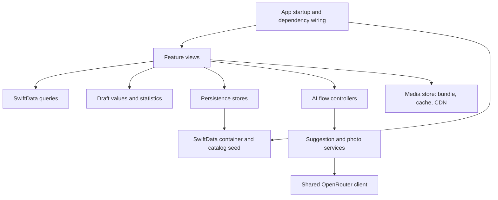

# Architecture

[Documentation index](README.md)

## Application shape

The app is one native iOS target, with unit-test and UI-test targets. It uses system frameworks rather than third-party package dependencies: SwiftUI for screens, SwiftData for persistence, Charts for graphs, UIKit/PhotosUI for images and capture, ImageIO for animation, Security for Keychain storage, and Foundation networking for remote requests.

The project uses filesystem-synchronized source groups. These directories are organizational layers within the same application target, not separately compiled Swift modules.



## Startup

The entry point is [SetoryApp.swift](../Setory/App/SetoryApp.swift).

- It constructs an `ExerciseMediaStore` and the AI dependencies once per app instance.
- Normal AI dependencies are `KeychainAPIKeyStore`, `OpenRouterSuggestionService`, and `OpenRouterPhotoMatchService`.
- Debug launch overrides can substitute deterministic services, an in-memory key, and offline media behavior.
- [AppModelContainer](../Setory/App/AppModelContainer.swift) declares all five persisted model types and creates the on-disk container.
- Container initialization applies an optional test reset, seeds the catalog if required, then optionally seeds test sessions. This order ensures sessions reference existing exercises.
- The window installs `RootTabView`, injects services through environment values, and attaches the model container.

Failure to create the database is fatal; there is no silent temporary-store fallback. Catalog seeding errors invoke `assertionFailure`, rather than replacing the persistent store.

## Layer responsibilities

| Directory | Responsibility |
| --- | --- |
| `App/` | Composition, persisted schema, root tabs, shared exercise routes |
| `Domain/Entities/` | Persisted fields, relationships, ordering, model-derived properties |
| `Domain/Vocabulary/` | Stable categories, equipment, and muscle raw values |
| `Domain/Drafts/` | Editable values and staged plans; `TemplateDraft.apply` also maps a draft to model items when called by its store |
| `Domain/Stats/` | Read-only history aggregation, calendar math, progress, and naming logic |
| `Persistence/` | Catalog loading/seeding and explicit writes |
| `Features/` | Screens, presentation state, callbacks, queries, and AI flow controllers |
| `AI/` | Wire types, request builders, response validation, transport, and key storage |
| `Media/` | Bundled thumbnails and remote GIF caching |
| `DesignSystem/` | Theme, shared rows and media views, display localization, and persistence call-site helper |
| `TestSupport/` | Launch argument parsing, fixtures, reset/seed logic, and service substitutions |

## Reading and writing state

Most screens read persisted records with `@Query`, then filter or aggregate those records in memory. Ordinary screen state uses `@State`: selected dates, search strings, draft fields, sheet selections, and loading flags. The AI controllers are observable main-actor objects whose work can be exercised without rendering a screen.

Writes initiated by feature views follow this route:

```text
User action → normalize/validate draft → persisting(...) → specific store
            → model insert/update/delete → saveOrRollback() → query-driven UI update
```

`WorkoutStore`, `TemplateStore`, and `ExerciseStore` conform to `PersistenceStore`. Its injectable `commit` defaults to saving the context. A failed commit calls `rollback()` and rethrows. `persisting` invokes `assertionFailure` on failure: it exposes failures during Debug development, while Release continues without a dedicated persistence-error alert. Success-only actions such as clearing drafts or dismissing an editor run after the store returns successfully.

Rollback prevents a failed change from being committed, but is not a promise to restore every property on an already-held model object in memory. See persistence tests before relying on that behavior.

Catalog startup writes are a separate path in `CatalogSeeder`.

## Navigation and sheets

[RootTabView](../Setory/App/RootTabView.swift) creates four tabs. Log, Exercises, and Progress provide their own navigation stacks; RootTabView wraps Routines in a stack.

`ExerciseRoute.detail(id)` and `.progression(id)` are registered by `exerciseDestinations()` in the Exercises and Progress stacks. Detail screens resolve a stable exercise ID against local records. Saved workout details are pushed directly with their `WorkoutSession`.

Two flows deliberately wait for a sheet to dismiss before presenting the next sheet:

- Log: exercise picker selection → pending exercise → set-entry sheet.
- Routines: AI suggestion → pending suggestion → template review editor.

Photo matching instead switches between capture and results inside one sheet. This retains its photos and hints while the user reviews matches.

## Boundaries to preserve

- Keep SwiftUI and implicit current-locale lookup out of persisted entities; display conveniences belong in `ExerciseDisplay`.
- Feature views call stores rather than directly inserting, deleting, saving, or rolling back models.
- Keep command-line parsing inside `TestSupport/LaunchOptions.swift`.
- Both AI features use the same OpenRouter transport, but keep distinct builders and parsers.
- The media store is a separate network path; OpenRouterClient is the only **AI** HTTP transport, not the app's only networking code.
- Use local exercise records as the authority for names, muscles, and media after resolving AI-returned IDs.
