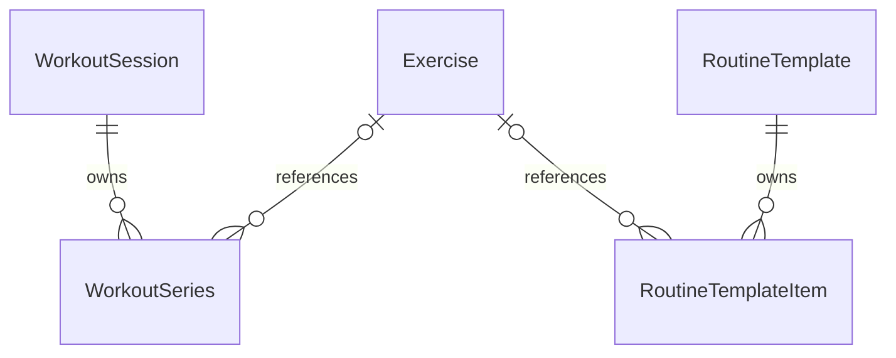

# Data, persistence, and statistics

[Documentation index](README.md)

## Persisted model relationships

The diagram shows the intended ownership structure. Child-to-parent and child-to-exercise properties are optional in code, so readers tolerate missing references.

| Model | Fields and rules |
| --- | --- |
| [Exercise](../gymapp/Domain/Entities/Exercise.swift) | Unique string `id`; name, category, primary/secondary muscle raw values, equipment, summary, instruction steps, GIF filename, translation dictionaries, and `isUserModified` |
| [WorkoutSession](../gymapp/Domain/Entities/WorkoutSession.swift) | Unique `date`, normalized to the current calendar's start of day on initialization; `finishedAt`; owned series |
| `WorkoutSeries` in the same file | Zero-based `order`, optional exercise/session references, optional `reps`, `weightKg`, and `durationSeconds` |
| [RoutineTemplate](../gymapp/Domain/Entities/RoutineTemplate.swift) | Name, creation date, owned items; no relationship to workout sessions |
| `RoutineTemplateItem` in the same file | Zero-based `order`, exercise/template references, target sets clamped to 1–10 on initialization |

Both parent-to-child relationships use cascade deletion. Deleting a template removes its items; the schema likewise cascades session deletion to series, although the production screens currently expose no session deletion action.

SwiftData relationship arrays do not define presentation order. `orderedSeries` and `orderedItems` sort by the explicit `order` column. Category and muscle accessors translate raw persisted strings into enum values; an unknown category falls back to strength, while unknown muscle/equipment values are omitted.

Exercises are referenced rather than snapshotted. Editing an exercise's name, muscles, or category therefore affects displays and calculations for existing templates and historical sets. Recorded numeric values remain stored as entered.

## What persists where

| State | Location | Lifetime |
| --- | --- | --- |
| Exercises, sessions, series, templates, items | On-disk SwiftData container | Across launches |
| Day drafts and applied plans | `LogView` state keyed by date | While that view state lives |
| Template/exercise form edits | Value drafts / form state | Until saved or discarded |
| AI goal, results, rationale, photos, and hints | Flow/sheet state | Current flow; accepted template fields persist only after editor Save |
| OpenRouter API key | Keychain generic-password item | Until replaced or cleared, subject to platform Keychain lifecycle |
| AI model override | UserDefaults key `aiModelOverride` | Across launches |
| Catalog seed version | UserDefaults key `exerciseCatalogVersion` | Across launches |
| Downloaded GIFs | App caches directory, `ExerciseGIFs/<id>.gif` | Reusable until removed; cache storage is not durable user data |

There is no explicit versioned migration plan in the app. `AppModelContainer.schema` lists all model types, and newer exercise fields include defaults to support compatible schema evolution. Adding a type to that list alone does not guarantee every possible future migration is supported.

## Write operations

- `WorkoutStore.finishDay`: creates one session and one ordered model series per draft, assigns parent relationships, then commits. The screen prevents empty saves or a second save for an already-finished date.
- `TemplateStore.save`: creates or updates a template, asks `TemplateDraft.apply` to replace its items in draft order, then commits.
- `TemplateStore.duplicate`: copies the name with a localized suffix and creates independent item records with matching exercise references and targets.
- `TemplateStore.delete`: deletes the parent and commits, allowing item cascade deletion.
- `ExerciseStore.save`: copies normalized edit values, marks the exercise modified, then commits.

Validation primarily lives in forms and draft types. Stores are not a general-purpose API that independently rejects all invalid caller input. SwiftData uniqueness can upsert instead of throwing; tests inject a failing commit closure to verify error handling.

## History and best sets

[ExerciseHistoryProvider](../gymapp/Domain/Stats/ExerciseHistoryProvider.swift) filters saved series by exercise ID and groups them by attached session date. Series without a session date are excluded from the resulting history. Sessions sort newest first; series within each session sort by `order`. The default recent-history limit is five sessions.

Best-set selection is category-dependent:

| Category/data | Best-set rule |
| --- | --- |
| Strength with any non-nil weight | Highest weight; repetitions break ties. Unweighted sets do not compete. |
| Strength with no weights | Highest repetitions |
| Cardio | Longest duration |

A recorded weight of zero still counts as a weighted set because the rule tests presence, not positivity.

## Overview and muscle balance

[ProgressStatsProvider](../gymapp/Domain/Stats/ProgressStatsProvider.swift) operates on fetched models and accepts a calendar and reference date for deterministic tests.

- Weekly chart: eight calendar-week buckets by default, oldest first, ending in the current week. Empty weeks remain visible as zero.
- Headlines: session counts and sum of each matching session's series count in the current calendar week/month, using calendar date intervals.
- Muscle balance: each saved series contributes one count to every primary muscle of its exercise, within the selected calendar period. Secondary muscles are excluded. Zero-count muscles are omitted; results sort by count descending, then muscle raw value.

For example, three sets of an exercise with two primary muscles contribute three to each muscle. The sum of muscle counts can exceed the number of sets. “Volume” in muscle balance means set counts, whereas the weighted progression volume below is repetitions multiplied by kilograms.

## Exercise progression

Series are grouped by saved session date and sorted chronologically. The metric is chosen across all attached history for that exercise:

| Metric | Session point | Additional value |
| --- | --- | --- |
| Weight, if strength has any weighted history | Highest recorded weight in that session | Sum of `reps × weightKg` over weighted sets in that session |
| Reps, if strength has no weighted history | Highest repetitions in that session | None |
| Duration, for cardio | Longest duration in seconds in that session | None |

When the metric is weight, sessions with no weighted set are omitted rather than shown as zero. Adding the first weighted set can therefore change an exercise's chart from reps to weight and exclude earlier unweighted-only sessions.

The first charted session is a personal record. Later sessions receive a record flag only if their best set strictly improves the running best. Weight is compared first and repetitions break ties, so a new record can occur at the same plotted weight with more reps. Reps-only and cardio records require strictly higher reps or duration. Equal performances are not new records.

## Template naming and coverage

`RoutineTemplate` derives primary muscle coverage as a union in first-appearance order. Secondary coverage uses the same ordering but excludes anything already primary. These values are never stored separately.

`TemplateNameSuggester` first counts primary-muscle votes. If lower-body muscles have more than half the votes, it suggests “Leg Day.” Otherwise, an all-cardio list suggests “Cardio.” Otherwise, it uses the top one or two muscles, with first appearance breaking ties. It returns no suggestion for an empty or otherwise unnameable list. This is local deterministic logic, independent of AI.
